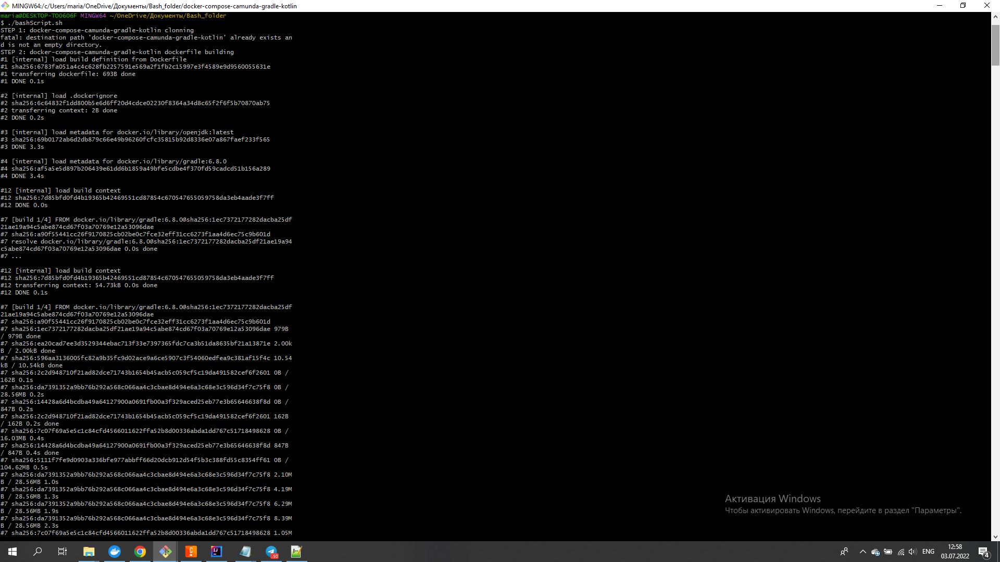
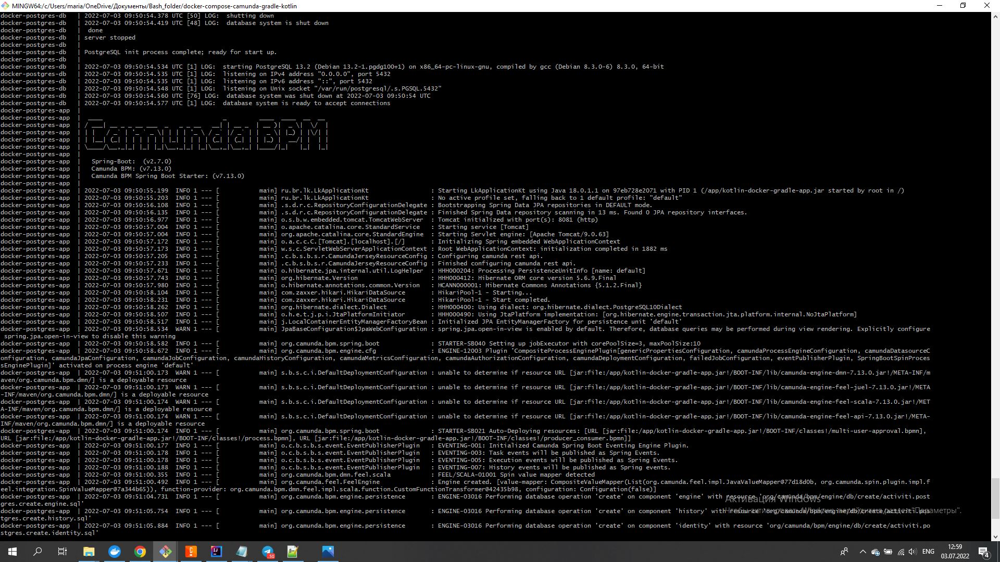
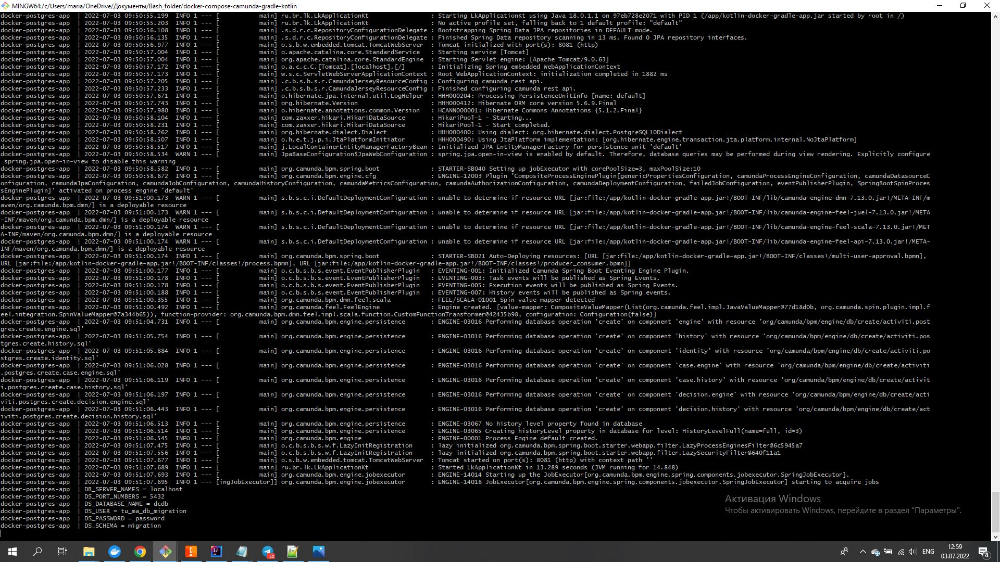

# bash-docker-1619-1620

Разработка конфигрураций для сборки ядра  p+

			./bashScript.sh

Сборка всех текущих версий образов может быть выполнена одним bash-скриптом, в котором будут собираться образы из Dockerfile.

Конфигурация включает в себя docker-compose для разворачивания собранных ранее образов. 